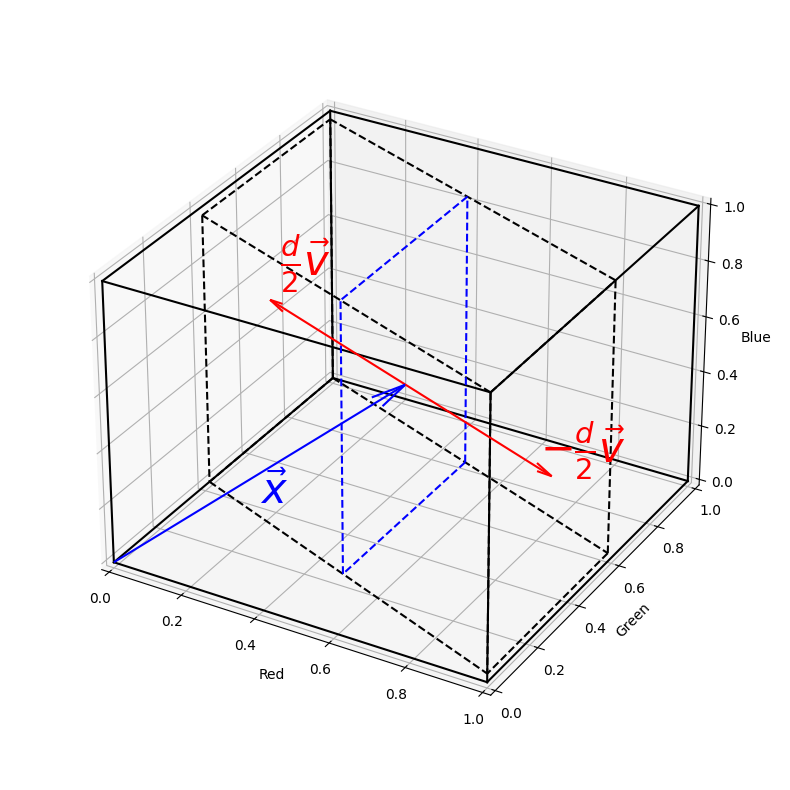

# Identifying Color Vision Deficiency in EEG data using Support Vector Machines

## Introduction

This project is part of my master's thesis on the machine learning based identification of Color Vision Deficiencies (CVDs). The basic idea is to evoke steady-state visual evoked potentials (SSVEPs) in the brain using stimuli, that appear differently to people with CVDs. 

SSVEPs are activations in the brain, as a response to visual stimuli at constant frequencies, like flickering lights, and can be measured using EEG. 
The stimuli used are reversal checkerboards. The fields of the checkerboard have two alternating colors, which are hard to distinguish for people with certain CVDs. The fields then switch their colors at a constant frequency, which should evoke stronger SSVEPs, the better the subject can distinguish the colors.

The documentation for most of the methods used can be found in [utils/](./utils). An image of the setup is shown below.

## Measurement Parameters

To determine the optimal tile size and frequency of the checkerboard, six subjects were measured using a black and white checkerboard with different tile sizes and frequencies. The tile size and frequency were compared using a Canonical Correlation Analysis based Signal-to-Noise Ratio. The analysis can be found in [notebooks/tile_size_and_frequency.ipynb](./notebooks/tile_size_and_frequency.ipynb). 

## Color Pairs

A way of approximating colors as seen by people with CVD was developed by Machado et al. in 2009. Translating colors in RGB space to the ones seen by people with CVD is done using a matrix multiplication, where the matrix is determined by the type and severity of CVD. 

To find a color pair, that is hard to distinguish for people with CVD, but has a high contrast for people with normal vision, the following optimization problem is formulated:

Objective: 

$$
\underset{c1, c2}{\operatorname{argmax}} \|c_1 - c_2\|^2
$$

Constraints: 

$$
c_1, c_2 \in [0, 1]^3, \quad M\,c_1 = M\,c_2
$$

with $c_1$ and $c_2$ being colors in RGB space and $M$ being the transformation matrix for specific CVD.

The problem can be solved geometrically by constructing two colors:

$$
c_1 = x + \frac{d}{2} \cdot v, \quad c_2 = x - \frac{d}{2} \cdot v
$$

$$
\mathrm{with} \quad v = \ker(M) \quad \Rightarrow \quad M\,v=0.
$$

Here $x$ acts as an anchor point and $d$ as the distance between the two colors, with $v$ assumed to be a normalized vector in the kernel of $M$. 

By construction $c_1$ and $c_2$ are equal in the CVD color space. The optimization problem can be solved by finding the optimal $x$ and $d$, which is done by finding intersections of a line with direction $v$ and a cube representing the RGB space. This is depicted in the following image.

This method allows finding an arbitrary number of color pairs. The color pairs chosen for the measurements are shown below.

The code for finding the color pairs can be found in [notebooks/color_pairs_geometric.ipynb](./notebooks/color_pairs_geometric.ipynb).

## Measurement

One measurement consists of four different color pairs. Each is shown for 4 seconds, with a reversal frequency of $16.5\,$Hz. In between each pair, a gray screen is shown for 3 seconds. 
Since CVDs are rare, they were simulated in subjects with regular color vision using the algorithm by Machado et al. to collect training data. 

In total, 15 subjects were measured, 12 of which had normal color vision and 3 had severe red-green deficiencies. The data was collected using an 8 channel EEG with a sampling rate of $250\,$Hz. 

For each subject 15 measurements without simulated CVD were recorded and for the subjects with regular color vision another 15 measurements with simulated CVD were recorded.

## Data Preprocessing

Sometimes the EEG had random spikes, because the Bluetooth connection failed for a few milliseconds, causing the buffer of the EEG to overfill. These spikes were removed by taking the first difference of the signal, setting all values above a certain threshold to zero, and then integrating the signal again. In addition, a bandpass and a notch filter were applied to the signal.

The 8 dimensional EEG signal was then reduced to a 1 dimensional signal using Canonical Correlation Analysis with a generated reference signal, consisting of a sine and a cosine wave at the stimulus frequency and its second harmonic.

## Classification

The pipeline for the classification is as follows:

1. Preprocessing 
2. Wavelet Transforms with different width parameters at frequencies around the stimulus frequency
3. Standard Scaling
4. Dimensionality reduction using PCA
5. Classification using a SVM with a custom kernel

The custom kernel is defined as:

$$
k(x, y) = \exp\{-\gamma \cdot [\alpha \cdot \|x-y\|^2 + (1-\alpha) \cdot 2\cdot(1-\frac{x \cdot y}{\|x\|\|y\|})]\}
$$

with $\alpha = \exp\{-\beta (\|x\| + \|y\|)\}$. For more information see [notebooks/generalized_cone_kernel.ipynb](./notebooks/generalized_cone_kernel.ipynb).

The hyperparameters of the Wavelet Transforms, PCA, kernel and SVM were optimized using Bayesian optimization. The objective function was the harmonic mean of the cross-validation accuracies, where the cross-validation was done using a leave-one-out strategy for each subject. 

The harmonic mean was chosen because it is more sensitive to infrequent low values than the arithmetic mean, encouraging the model to perform well on all subjects, not just the majority.

The hyperparameter tuning can be found in [notebooks/svm_hyperparameters.ipynb](./notebooks/svm_hyperparameters.ipynb).

## Evaluation

To evaluate the model, 3 subjects with regular colors vision and the 3 subjects with red-green deficiencies were used. The 3 subjects with regular color vision were chosen at random, and all 6 subjects were not part of the training data. 

The model is first evaluated on the subjects without CVD to see how well it can distinguish between measurements with and without simulated CVD. Here the model achieves an accuracy of $90.70\,$% and an AUC of $0.97$, the ROC curve is shown below.

The model is then evaluated on the subjects with real CVD, where it achieves an accuracy of $82.05\,$%.

Next, we will make use of having multiple measurements / predictions per subject. To get a final prediction for each subject, a beta distribution is fitted to the predictions for the training set with and without simulated CVD respectively. 

The histograms and fitted distributions are shown below.

No simulated CVD:

Simulated CVD:

Then the likelihoods of the predictions for the test set under the fitted beta distributions are computed per subject. The final prediction for each subject is then 1, if the likelihood ratio is greater than 1 and 0 otherwise, with 1 indicating the presence of a CVD.

The following table shows the results for the final predictions:

| Subject | Likelihood Ratio | Prediction | Actual |
|-|-|-|-|
| 1 | $5.95 \cdot 10^{-45}$ | 0 | 0 |
| 2 | $1.05 \cdot 10^{-15}$ | 0 | 0 |
| 3 | $5.06 \cdot 10^{-22}$ | 0 | 0 |
| 4 | $2.52 \cdot 10^{44}$ | 1 | 1 |
| 5 | $5.48 \cdot 10^{2}$  | 1 | 1 |
| 6 | $3.53 \cdot 10^{2}$ | 1 | 1 |

The evaluation can be found in [notebooks/svm_eval.ipynb](./notebooks/svm_eval.ipynb).
